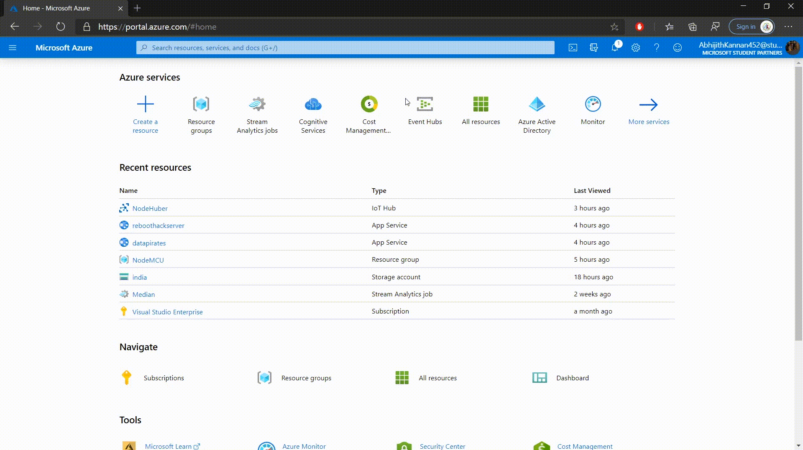
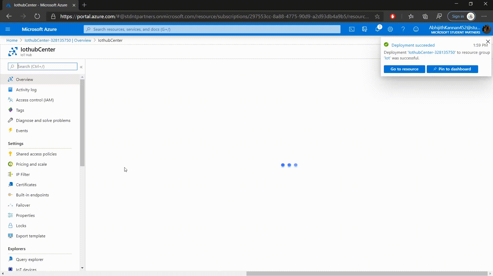

Many developers use NodeMCU esp8266 module for creating Iot devices. Azure is one of biggest cloud service providers in the world. In this blog post, i will be showing you how to sent data collected by the NodeMCU esp8266 module to Azure and store it.

We will need to create 3 resourses in Azure to collect and store data. They are Azure Iothub, Stream Analysis and Azure Storage. Azure Iothub is a service which enables bidirectional communication with billions of IoT devices. Stream Analysis job is service which is capable of setting up a real-time analytic computations on data streaming. This service is used to transfer the data recieved by Azure Iothub to Azure Storage. Azure storage account contains all of Azure Storage data objects: blobs, files, queues, tables, and disks. We will be using Azure table storage to store the dat.

### Setting up Azure 

* Create an account in Microsoft Azure
* Create a new Resource Group  

* Create Iothub and add a new device

* Copy the primary connection string of the device

* Create Azure table storage

* Create Stream Analysis

* Config input and output of Stream Analysis

### Setting up the hardware

We will be using my tweeked verison of the sample code provided by Microsoft which available on my github account. Before we upload the code to NoduMCU, we will need to install the following libraries :

* AzureIoTHub.h
* AzureIoTProtocol_MQTT.h
* AzureIoTUtility.h

 After installtion follow the following instruction as given in azure-iot-arduino repository
 
 1. Install esp8266 board support into your Arduino IDE.

    - Start Arduino and open Preferences window.

    - Enter `http://arduino.esp8266.com/stable/package_esp8266com_index.json` into Additional Board Manager URLs field. You can add multiple URLs, separating them with commas.

    - Open Boards Manager from Tools > Board menu and install esp8266 platform 2.5.2 or later

    - Select your ESP8266 board from Tools > Board menu after installation

2. Open the `iothub_ll_telemetry_sample` example from the Arduino IDE File->Examples->AzureIoTHub menu.

3. Update Wifi SSID/Password in `iot_configs.h`

    - Ensure you are using a wifi network that does not require additional manual steps after connection, such as opening a web browser.

4. Update IoT Hub Connection string in `iot_configs.h`

5. Navigate to where your esp8266 board package is located, typically in `C:\Users\<your username>\AppData\Local\Arduino15\packages` on Windows and `~/.arduino15/packages/` on Linux
	
- Locate the board's `Arduino.h` (`hardware/esp8266/<board package version>/cores/esp8266/` and comment out the line containing `#define round(x)`, around line 137.

- Two folders up from the `Arduino.h` step above, in the same folder as the board's `platform.txt`, paste the [`platform.local.txt`](https://github.com/Azure/azure-iot-arduino/blob/master/examples/iothub_ll_telemetry_sample/esp8266/platform.local.txt) file from the `esp8266` folder in the sample into it.

	- Note1: It is necessary to add `-DDONT_USE_UPLOADTOBLOB` and `-DUSE_BALTIMORE_CERT` to `build.extra_flags=` in a `platform.txt` in order to run the sample, however, you can define them in your own `platform.txt` or a `platform.local.txt` of your own creation. 
	
	- Note2: If your device is not intended to connect to the global portal.azure.com, please change the CERT define to the appropriate cert define as laid out in [`certs.c`](https://github.com/Azure/azure-iot-sdk-c/blob/master/certs/certs.c)
	
	- Note3: Due to RAM limits, you must select just one CERT define.

6. Run the sample.
	