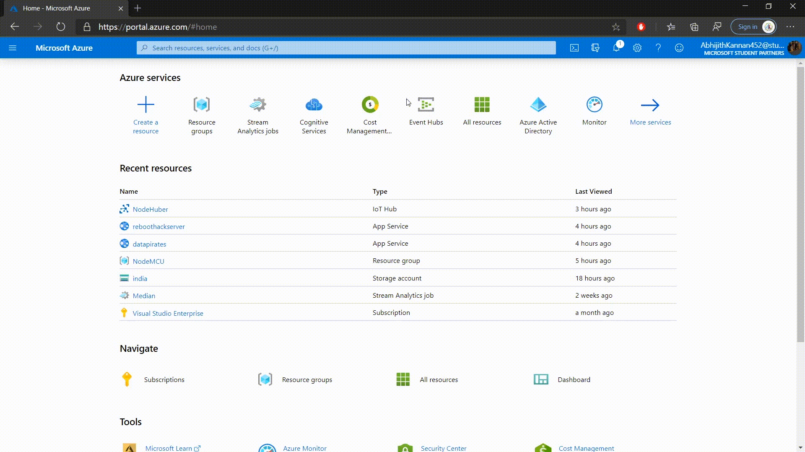
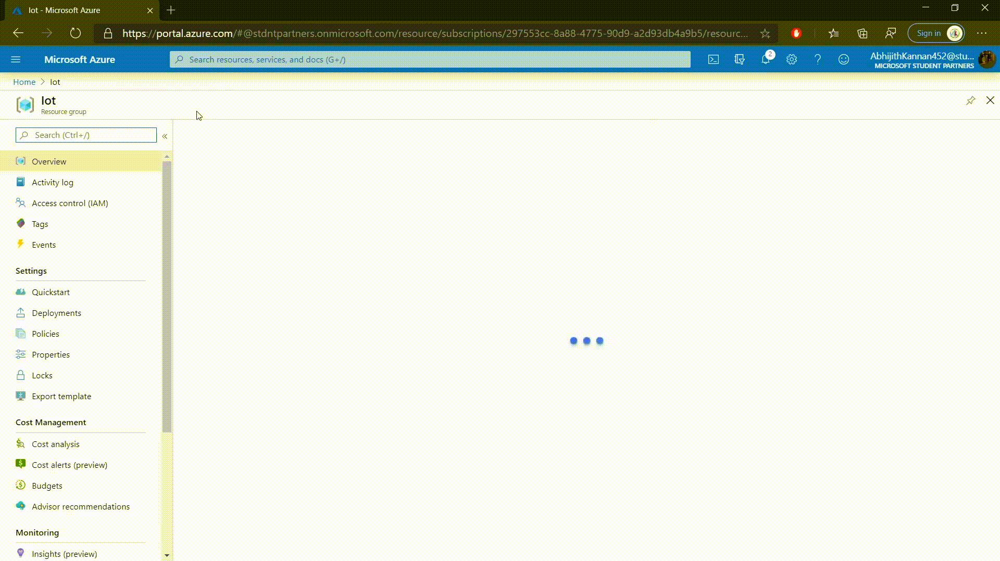
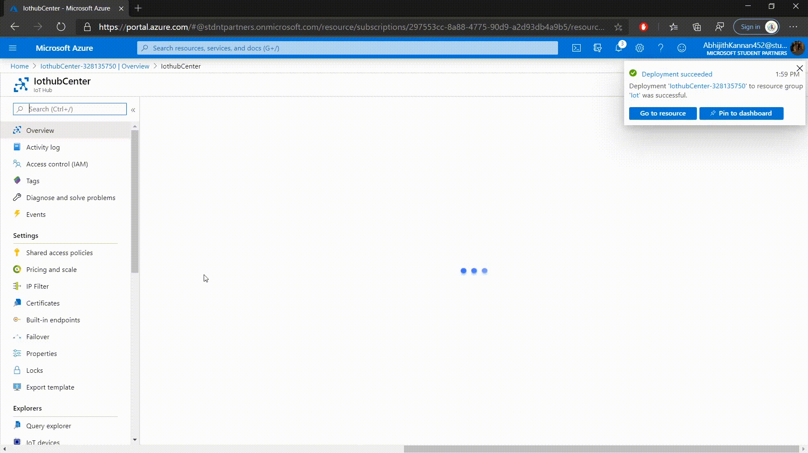

This a system capable of monitoring water distribution pipeline network. The parameter been collected are ph, water pressure and flowrate. The value of these parameters are been collected by ph senors,water flow sensors and water pressure sensor which are connected to arduino UNO board. These readings are sent to the NodeMCU esp8266 board and it sent the reading to the Azure Iothub. The reading the recieved by Azure Iothub is fetched by the webapp and been plotted in the graphs available in the web app.

## Setup

### Setting up Azure Iothub

* Create an account in Microsoft Azure
* Create a new Resource Group  

* Create Iothub and add a new device

* Copy the primary connection string of the device

### Setting up the hardware

Here we will be using both nodeMCU esp8266 and arduino uno. Since NodeMCU esp 8266 have only 1 anolog pin, we will need use arduino uno to collect sensor readings. We will be using SoftwareSerial library for arduino uno to nodeMCU communication. For senting data to Azure Iothub, we will be using the sample code provided by Microsoft on github.

For making this easier, i have made a github repo containing the codes for nodeMCU and arduino nano. Basically what the code is doing is that the nodeMCU sents a number to arduino and based on that number a function is called which will generate a random value and sent it to NoduMCU. The NodeMCU after getting the information it needs, it create a json file containing the readings and sent to Azure Iothub. Download or clone the repo and open nodeMCU folder and open app.ino file in arduino IDE or visual studio code. Input your ssid, password and connection string and upload it to NodeMCU. 

The code given in the arduino folder doesn't contain the actual code required to read values from the sensor. The code only sents the a random value when nodeMCU ask for it. Upload the code to arduino and connect the D6 and D5 pins of NodeMCU esp8266 to D6 and D5 pins respectively. If all went correct you should get this message in your serial monitor.

### Setting up the WebApp

The web app will be build on the React.js library. The web app consist of a Node js server collecting the information recieved on Azure IotHub and sents it to client web app which is built on react js library. We will be using recharts for creating the charts. The communication between the Nodejs server and the webapp is made with the help of socket.io library and the Nodejs server recieves the infromation from Iothub with the help of @azure/event-hub library. 

#### Server

* Download the file on the path `Water-Pipeline-Distribution-Network-Monitoring-System/React-app/server/`
* Open the folder in your IDE
* Open `server.js`and input the Iot hub connection string and consumer group as suggested on the [microsoft documentation](https://docs.microsoft.com/en-us/azure/iot-hub/iot-hub-live-data-visualization-in-web-apps)
* Open terminal and type `npm install`
* Once the installation is complete, type in `npm start` in terminal.
* You see the message `server is running` in your browser.

#### Webapp

* Download the file on the path `Water-Pipeline-Distribution-Network-Monitoring-System/React-app/client/`
* Open the folder in your IDE
* Open terminal and type `npm install`
* Once the installation is complete, type in `npm start` in terminal.

 You should be able see the graph been updated in real-time if the arduino is senting the values.

For more details please refer the README.md files in each folder

